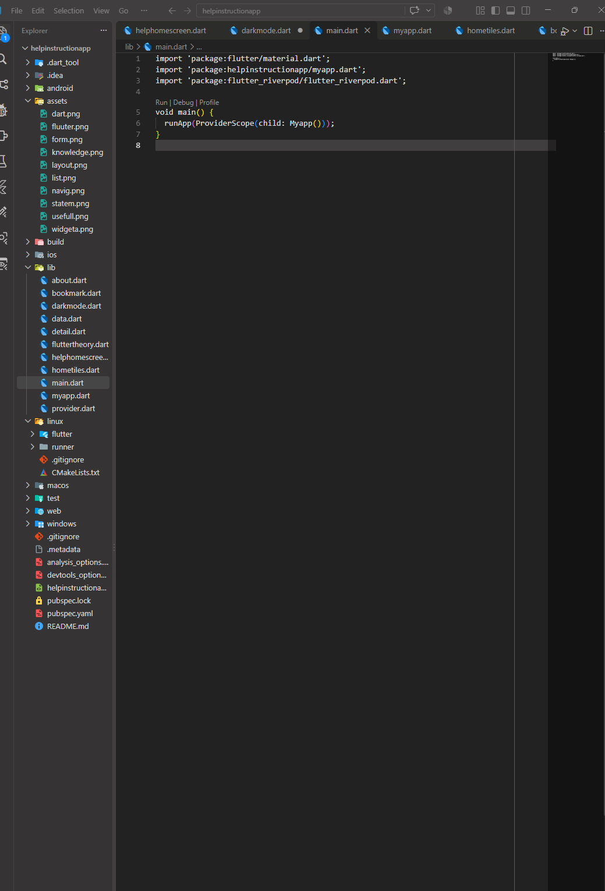
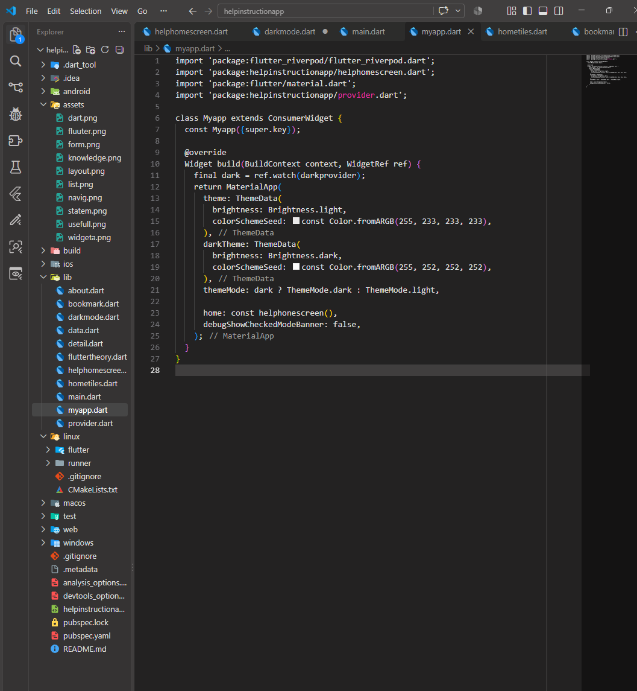
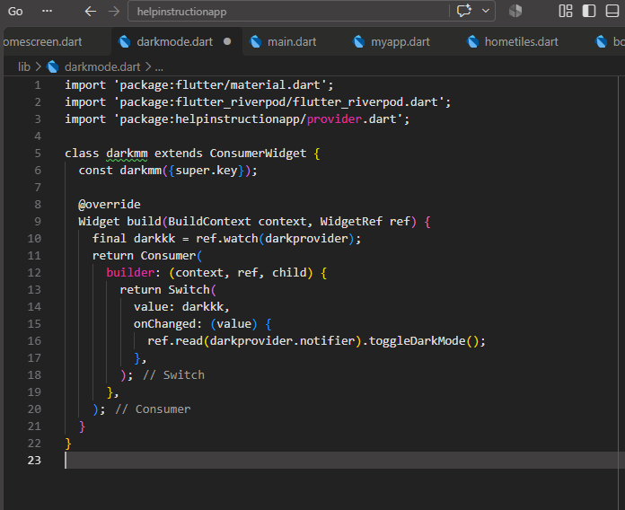
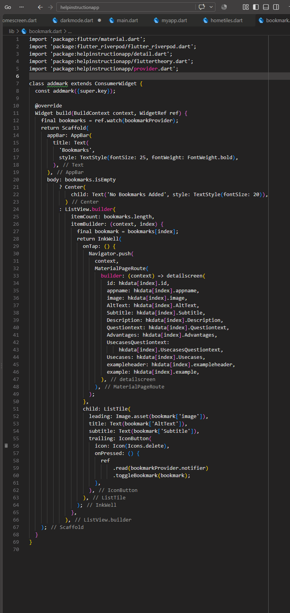
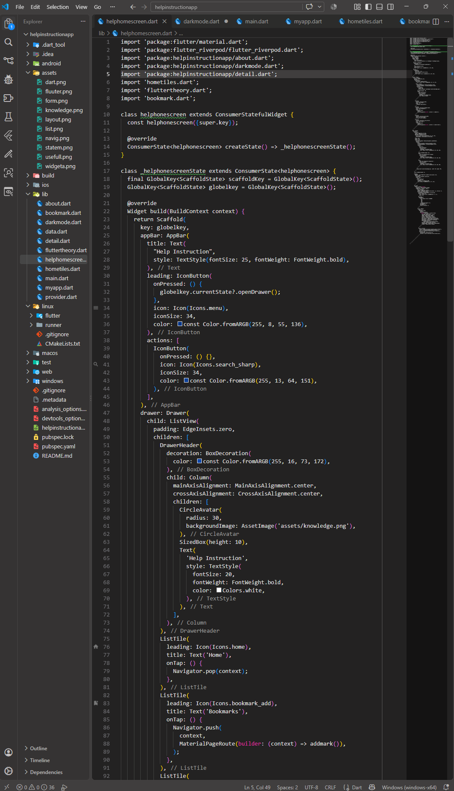
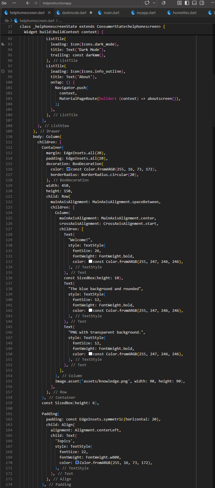
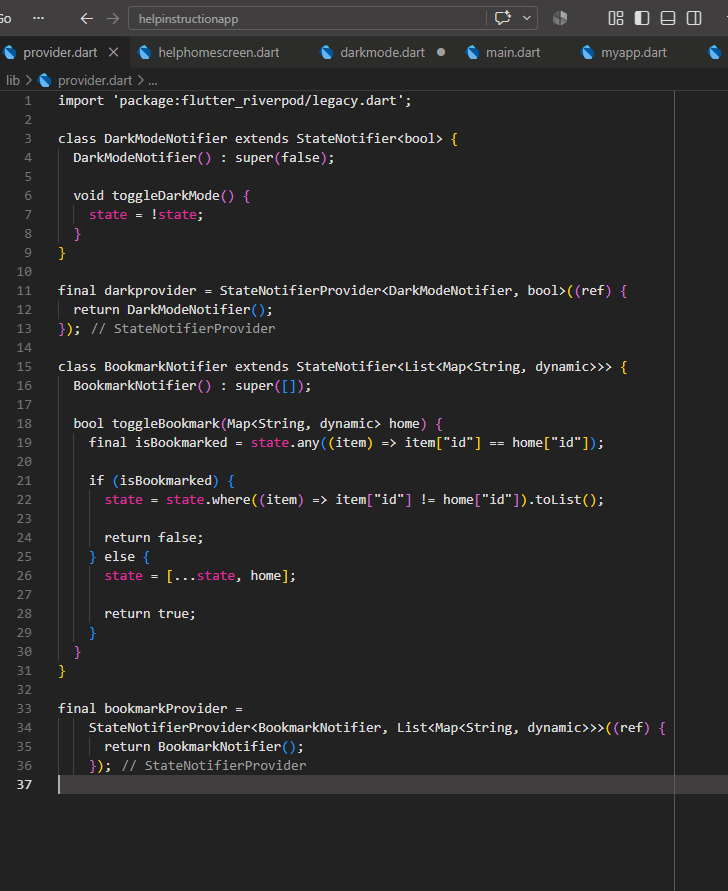

# help-instruction-App-State-Management
help instruction App State Management is a Flutter application that provides users with clear and organized guidance about different Flutter concepts. It includes easy-to-understand explanations, key advantages, use cases, examples, and important notes to help beginners learn Flutter step by step.
## 📱 App Screenshot

## ✨ Features
- Flutter concepts
- State Management
- Riverpod
- Bookmark
- Dark Mode
- Navigation

